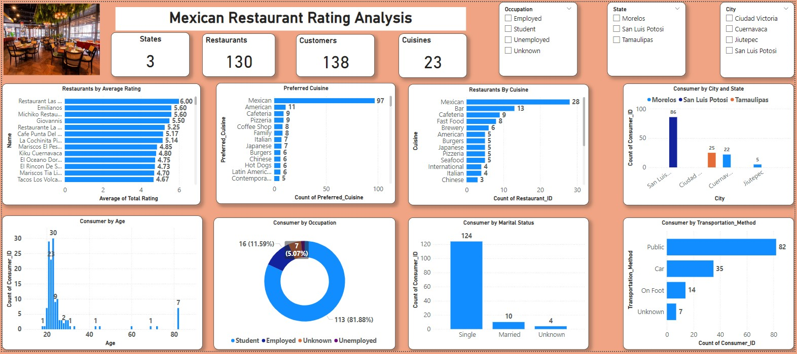

# Mexican-Restaurant-Rating

---

## Introduction:
This is a Power Bi project on Data Analyst for restaurants in mexico. A customer survey was carried out in this city in 2012 to collate information about each
restaurant, their cuisines, information about their consumers and the preferences of the consumers. An analysis has been done to draw out meaningful insight from this dataset which
would aid business entrepreneurs and investors in making more informed decisions.

---

## Problem Statement:
1. What can you learn from the highest rated restaurants? Do consumer preferences have an effect on
ratings?
2. What are the consumer demographics? Does this indicate a bias in the data sample?
3. Are there any demand & supply gaps that you can exploit in the market?
4. If you were to invest in a restaurant, which characteristics would you be looking for?

---

## Dashboard:

---

## Analysis:
### Restraurants
- The Restaurant with the highest average rating is **Restaurant Las Mananitas** (6).
- Yes, consumer preference has an effect on rating, we see that Restaurant Las Mananitas offers a majority of the prefered cuisines. 

### Consumer Demographics
- A majority of the consumers are in their 20s
- A majority of the consumers are students
- A majority of the consumers reside in the state and city of San Luis Potosi 
- A majority of the consumers are Medium-budget clients
- A majority of the consumers use public transportation methods.

### Demand & Supply Gaps to Exploit in the Market
- There is a demand & supply gaps that can be exploited in the market in regards to _Cuisines_.
- A majority of the consumers prefer _Mexican Cuisine (97)_ while only a _few restaurants (28)_ are offering the cuisine.

## Characteristics to look for as a potential invester in a restaurant
As an invester based on the analysis, the following are some of the characteristics I would look for:
1. The largest number of consumers - In this case I would capitalize on _Students_ as they are the majority of the consumers
2. Target consumers in terms of Age - I would target people below 30 years of age as they seem to be the majority of the consumers.
3. State and City - I would invest in the state and city of San Luis Potosi as majority of the consumers come from that geographical location.and ensure their is easy accessible to the restaurant especially for consumers that take Public Transport
4. Demographic in terms of marital status - I would target Single Consumers as they are more likely to eat outside than cook.
5. Demographic in terms of budget - The Cuisines offered should be around a range that Medium Budget Consumers can meet.
6. Lastly, I would forcus on offering cuisines that are highly ranked in terms of preference like Mexican to bridge the gap between demand and supply.

---
