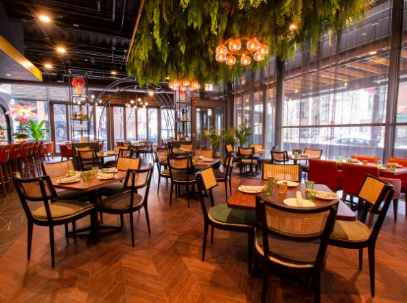

# Mexican-Restaurant-Rating

---

## Introduction:
This is a Power Bi project on Data Analyst for restaurants in mexico. A customer survey was carried out in this city in 2012 to collate information about each
restaurant, their cuisines, information about their consumers and the preferences of the consumers. An analysis has been done to draw out meaningful insight from this dataset which
would aid business entrepreneurs and investors in making more informed decisions.

---

## Problem Statement:
1. What can you learn from the highest rated restaurants? Do consumer preferences have an effect on
ratings?
2. What are the consumer demographics? Does this indicate a bias in the data sample?
3. Are there any demand & supply gaps that you can exploit in the market?
4. If you were to invest in a restaurant, which characteristics would you be looking for?

---

## Analysis:
### Restraurants

### Consumer Demographics
- A majority of the consumers are below 30 years of age
- A majority of the customers are students

### Demand & Supply Gaps to Exploit in the Market
- There is a demand & supply gaps that can be exploited in the market in regards to _Cuisines_.
- A majority of the consumers prefer _Mexican Cuisine (97)_ while only a _few restaurants (28)_ are offering the cuisine.

---

## Conclusion and Recommendations:

---
